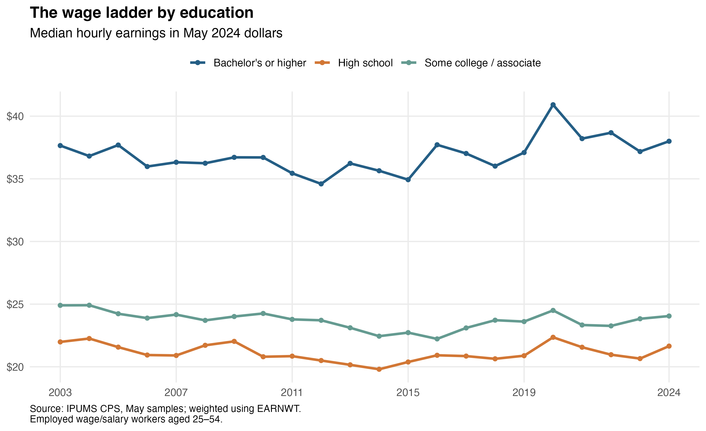
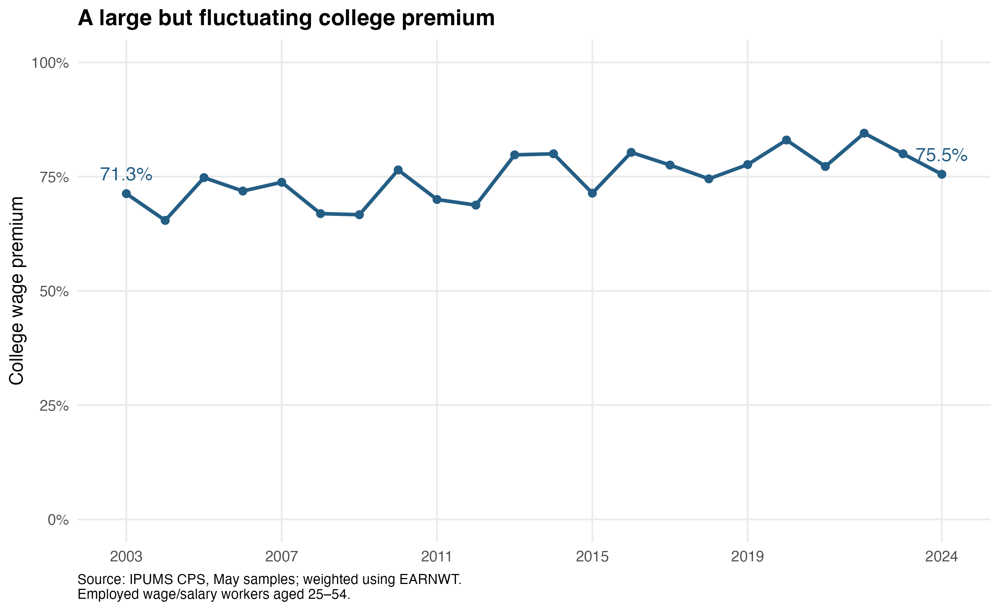
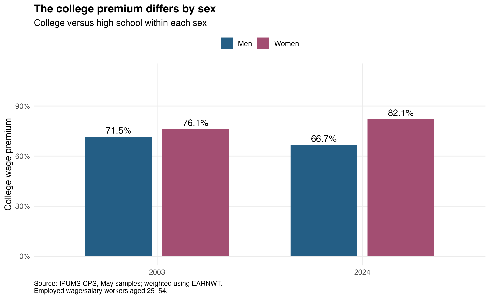

```{r}
#| label: setup
#| include: false

library(data.table)
library(ggplot2)

# Project-relative input; see README.md for download instructions.
data_file <- "data/raw/cps_00001.csv.gz"

if (!file.exists(data_file)) {
  stop("Place your IPUMS extract at data/raw/cps_00001.csv.gz. See README.md.")
}

variables <- c(
  "YEAR", "MONTH", "AGE", "SEX", "EMPSTAT",
  "CLASSWKR", "EDUC", "EARNWT", "EARNWEEK2", "UHRSWORK1"
)

# Decompress in small blocks with base R, then read selected columns.
# This works on macOS, Windows, and Linux without an extra package.
read_extract <- function(path, columns) {
  temporary_csv <- tempfile(fileext = ".csv")
  on.exit(unlink(temporary_csv), add = TRUE)
  decompress <- function() {
    input <- gzfile(path, "rb")
    on.exit(close(input), add = TRUE)
    output <- file(temporary_csv, "wb")
    on.exit(close(output), add = TRUE)
    repeat {
      block <- readBin(input, what = "raw", n = 1048576)
      if (!length(block)) break
      writeBin(block, output)
    }
  }
  decompress()
  fread(temporary_csv, select = columns)
}
cps <- read_extract(data_file, variables)

stopifnot(
  all(cps$MONTH == 5),
  setequal(unique(cps$YEAR), 2003:2024)
)

# Employed civilian wage/salary workers with valid earnings,
# positive earnings weights, and valid usual main-job hours.
workers <- cps[
  AGE >= 25 & AGE <= 54 &
    EMPSTAT %in% c(10, 12) &
    CLASSWKR %in% 20:28 &
    is.finite(EARNWT) & EARNWT > 0 &
    EARNWEEK2 > 0 & EARNWEEK2 < 999999.99 &
    UHRSWORK1 >= 1 & UHRSWORK1 <= 99 &
    SEX %in% c(1, 2)
]

workers[, education := fcase(
  EDUC == 73, "High school",
  EDUC %in% c(81, 91, 92), "Some college / associate",
  EDUC %in% c(111, 123, 124, 125), "Bachelor's or higher",
  default = NA_character_
)]

workers <- workers[!is.na(education)]
workers[, sex := fifelse(SEX == 1, "Men", "Women")]

# Common nominal weekly cap for comparability.
workers[, hourly_uncapped := EARNWEEK2 / UHRSWORK1]
workers[, hourly := pmin(EARNWEEK2, 2884.61) / UHRSWORK1]

# May CPI-U: BLS series CUUR0000SA0.
# Not seasonally adjusted; 1982–84 = 100.
cpi <- data.table(
  YEAR = 2003:2024,
  CPI = c(
    183.500, 189.100, 194.400, 202.500,
    207.949, 216.632, 213.856, 218.178,
    225.964, 229.815, 232.945, 237.900,
    237.805, 240.229, 244.733, 251.588,
    256.092, 256.394, 269.195, 292.296,
    304.127, 314.069
  )
)

base_cpi <- cpi[YEAR == 2024, CPI]
workers <- merge(workers, cpi, by = "YEAR", all.x = TRUE)
stopifnot(!anyNA(workers$CPI))

workers[, real_hourly := hourly * base_cpi / CPI]

# First observation reaching half the cumulative weight.
weighted_median <- function(x, w) {
  valid <- is.finite(x) & is.finite(w) & w > 0
  x <- x[valid]
  w <- w[valid]

  if (length(x) == 0) return(NA_real_)

  index <- order(x)
  x <- x[index]
  w <- w[index]

  x[which(cumsum(w) >= sum(w) / 2)[1]]
}

education_summary <- workers[, .(
  median_wage = weighted_median(real_hourly, EARNWT),
  sample_n = .N
), by = .(YEAR, education)]

setorder(education_summary, YEAR, education)

college_premium <- dcast(
  education_summary,
  YEAR ~ education,
  value.var = "median_wage"
)

college_premium[, premium :=
  100 * (`Bachelor's or higher` / `High school` - 1)
]

sex_summary <- workers[, .(
  median_wage = weighted_median(real_hourly, EARNWT),
  sample_n = .N
), by = .(YEAR, sex, education)]

sex_premium <- dcast(
  sex_summary,
  YEAR + sex ~ education,
  value.var = "median_wage"
)

sex_premium[, premium :=
  100 * (`Bachelor's or higher` / `High school` - 1)
]

# Sensitivity: full-time workers.
full_time <- workers[UHRSWORK1 >= 35, .(
  median_wage = weighted_median(real_hourly, EARNWT)
), by = .(YEAR, education)]

full_time <- dcast(
  full_time,
  YEAR ~ education,
  value.var = "median_wage"
)

full_time[, premium :=
  100 * (`Bachelor's or higher` / `High school` - 1)
]

# Sensitivity: effect of the common earnings cap.
topcode_check <- workers[, .(
  capped = weighted_median(hourly, EARNWT),
  uncapped = weighted_median(hourly_uncapped, EARNWT)
), by = .(YEAR, education)]

# Helpers: insert computed values directly into the article.
premium_at <- function(year) {
  sprintf("%.1f", college_premium[YEAR == year, premium])
}

wage_at <- function(year, group) {
  sprintf(
    "%.2f",
    education_summary[
      YEAR == year & education == group,
      median_wage
    ]
  )
}

sex_premium_at <- function(year, group) {
  sprintf(
    "%.1f",
    sex_premium[YEAR == year & sex == group, premium]
  )
}

# Save results for reproducibility.
dir.create("results", showWarnings = FALSE)
dir.create("figures", showWarnings = FALSE)

fwrite(education_summary, "results/education_medians.csv")
fwrite(college_premium, "results/college_premium.csv")
fwrite(sex_summary, "results/sex_education_medians.csv")
fwrite(sex_premium, "results/sex_premium.csv")
fwrite(full_time, "results/full_time_sensitivity.csv")
fwrite(topcode_check, "results/topcode_sensitivity.csv")
fwrite(cpi, "results/cpi_may.csv")
writeLines(capture.output(sessionInfo()), "results/sessionInfo.txt")

# Shared chart formatting.
theme_set(
  theme_minimal(base_size = 12) +
    theme(
      panel.grid.minor = element_blank(),
      legend.position = "top",
      plot.title = element_text(face = "bold"),
      plot.caption = element_text(hjust = 0, size = 9)
    )
)

education_colors <- c(
  "High school" = "#D27735",
  "Some college / associate" = "#659B91",
  "Bachelor's or higher" = "#245E85"
)

source_note <- paste(
  "Source: IPUMS CPS, May samples; weighted using EARNWT.",
  "Employed wage/salary workers aged 25–54.",
  sep = "\n"
)
```


College-educated workers earned about **`r premium_at(2024)`% more per hour** than high-school graduates in May 2024, based on the weighted medians in this sample. That is a large advantage. But whether it has grown since 2003 depends on which workers we compare: the gap increased slightly in the main sample and declined slightly when I restricted it to full-time workers.

That distinction matters when discussing education and pay. A large wage advantage today does not automatically mean the advantage is growing, or that graduates' purchasing power has improved.

I use IPUMS Current Population Survey data for employed wage and salary workers aged 25–54, comparing May observations from 2003 through 2024. These are historical snapshots, not a measure of today's job market.

## A large advantage, little change at the endpoints

```{r}
#| label: fig-wages
#| fig-width: 9
#| fig-height: 5.5
#| fig-cap: "Weighted median real hourly earnings by education, May 2003–2024."

figure1 <- ggplot(
  education_summary,
  aes(YEAR, median_wage, color = education)
) +
  geom_line(linewidth = 1.1) +
  geom_point(size = 1.5) +
  scale_color_manual(values = education_colors) +
  scale_x_continuous(
    breaks = c(2003, 2007, 2011, 2015, 2019, 2024)
  ) +
  scale_y_continuous(
    labels = function(x) paste0("$", x)
  ) +
  labs(
    title = "The wage ladder by education",
    subtitle = "Median hourly earnings in May 2024 dollars",
    x = NULL,
    y = NULL,
    color = NULL,
    caption = source_note
  )

ggsave(
  "figures/figure1.png", figure1,
  width = 9, height = 5.5, dpi = 300, bg = "white"
)


```

In May 2024, workers with a bachelor's degree or higher had median hourly earnings of $`r wage_at(2024, "Bachelor's or higher")`, compared with $`r wage_at(2024, "High school")` for high-school graduates and $`r wage_at(2024, "Some college / associate")` for those with some college or an associate degree.

The separation between the groups is clear. The change over time is less dramatic: in May 2024 dollars, the college median was $`r wage_at(2003, "Bachelor's or higher")` in 2003, while the high-school median was $`r wage_at(2003, "High school")`. Both were close to their 2024 levels.

I read this as a distinction between relative advantage and progress in purchasing power. College graduates can remain well ahead of another group without their own real median earnings rising much. Neither finding cancels the other.

## Is the gap growing? The comparison matters

The college wage premium measures how much higher the college median is than the high-school median, as a percentage of the high-school median.

```{r}
#| label: fig-premium
#| fig-width: 9
#| fig-height: 5.5
#| fig-cap: "College wage premium calculated from weighted median hourly earnings."

figure2 <- ggplot(
  college_premium,
  aes(YEAR, premium)
) +
  geom_line(color = "#245E85", linewidth = 1.1) +
  geom_point(color = "#245E85", size = 2) +
  geom_text(
    data = college_premium[YEAR %in% c(2003, 2024)],
    aes(label = sprintf("%.1f%%", premium)),
    vjust = -1,
    color = "#245E85"
  ) +
  scale_x_continuous(
    breaks = c(2003, 2007, 2011, 2015, 2019, 2024),
    expand = expansion(mult = 0.06)
  ) +
  scale_y_continuous(
    limits = c(0, 100),
    labels = function(x) paste0(x, "%")
  ) +
  labs(
    title = "A large but fluctuating college premium",
    x = NULL,
    y = "College wage premium",
    caption = source_note
  )

ggsave(
  "figures/figure2.png", figure2,
  width = 9, height = 5.5, dpi = 300, bg = "white"
)


```

The premium moved from `r premium_at(2003)`% in 2003 to `r premium_at(2024)`% in 2024, with fluctuations in between. It reached `r premium_at(2022)`% in 2022 before falling. That is not a steady upward path.

Restricting the sample to workers usually working at least 35 hours per week changes the endpoint story: the premium moved from **`r sprintf("%.1f", full_time[YEAR == 2003, premium])`% to `r sprintf("%.1f", full_time[YEAR == 2024, premium])`%**. The direction reverses, although the large college advantage remains.

For me, that check is a reason to be cautious about a headline declaring that the gap is widening. The enduring gap is clearer than the small change between two selected years. I have not calculated confidence intervals, so these movements are not established statistically significant changes.

Employment composition also matters. A rise in the median can reflect changes in who is working, not just pay increases. These comparisons do not follow individual workers' wage growth or establish what caused the movements around 2020.

## One overall number hides different patterns

```{r}
#| label: fig-sex
#| fig-width: 9
#| fig-height: 5.5
#| fig-cap: "Within-sex college wage premiums in May 2003 and May 2024."

figure3 <- ggplot(
  sex_premium[YEAR %in% c(2003, 2024)],
  aes(factor(YEAR), premium, fill = sex)
) +
  geom_col(
    position = position_dodge(0.75),
    width = 0.65
  ) +
  geom_text(
    aes(label = sprintf("%.1f%%", premium)),
    position = position_dodge(0.75),
    vjust = -0.5
  ) +
  scale_fill_manual(
    values = c("Men" = "#245E85", "Women" = "#A34E72")
  ) +
  scale_y_continuous(
    limits = c(0, 110),
    labels = function(x) paste0(x, "%")
  ) +
  labs(
    title = "The college premium differs by sex",
    subtitle = "College versus high school within each sex",
    x = NULL,
    y = "College wage premium",
    fill = NULL,
    caption = source_note
  )

ggsave(
  "figures/figure3.png", figure3,
  width = 9, height = 5.5, dpi = 300, bg = "white"
)


```

Among women, the premium rose from `r sex_premium_at(2003, "Women")`% to `r sex_premium_at(2024, "Women")`%; among men, it fell from `r sex_premium_at(2003, "Men")`% to `r sex_premium_at(2024, "Men")`%. The overall comparison conceals these different directions.

A larger premium for women does not mean women earn more than men. Each percentage compares college and high-school graduates within the same sex. It also cannot tell us whether education itself explains the gap: occupation, experience and selection into employment may differ.

## What I take from these results

The strongest finding is a persistent college wage advantage, not a consistently widening one. I would ask who is included and which years are compared before drawing conclusions from a single premium.

These results also do not settle whether college is worth its cost. They describe employed workers, include graduate degrees, and do not measure tuition, forgone earnings or the causal effect of attending college.

## Data, methods and reproducibility

The sample contains `r format(nrow(workers), big.mark = ",")` person-month observations with at least a high-school qualification. I exclude self-employed workers and invalid earnings or hours. Hourly earnings are weekly earnings divided by usual main-job hours; all medians use **EARNWT**, the CPS earnings-study weight. BLS CPI-U converts wages to May 2024 dollars. These are May snapshots, not annual averages.

I use the harmonized rounded earnings series and cap weekly earnings at $2,884.61 across years. The cap leaves the overall education-group medians unchanged, but does not eliminate all measurement differences from the 2023–2024 reporting changes. Imputed earnings remain included because allocation flags were not downloaded.

Sources: [IPUMS CPS](https://cps.ipums.org/cps/), its [earnings](https://cps.ipums.org/cps-action/variables/EARNWEEK2) and [weight](https://cps.ipums.org/cps-action/variables/EARNWT) documentation, and [BLS CPI-U](https://data.bls.gov/timeseries/CUUR0000SA0?years_option=all_years). The [repository and README](https://github.com/ruibao1129/6400-rb/tree/main/blog/posts/post3) provide code, saved figures and results, plus instructions for obtaining the IPUMS extract and reproducing the analysis.
